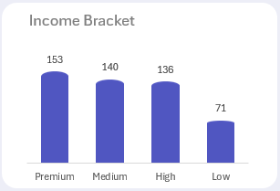
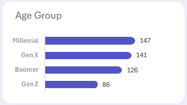
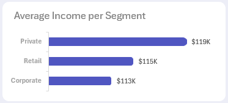
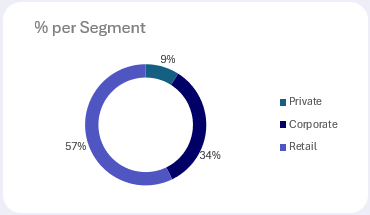
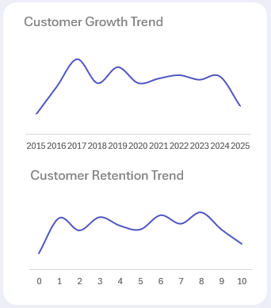
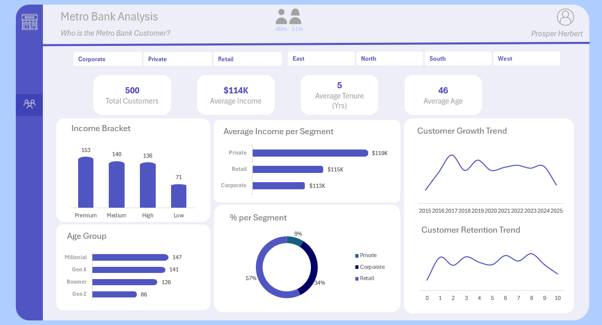

# Metro-Bank-Customers
This analysis explores Metro Bank customers. Their wealth profile, age group, segment, and loyalty. It also provides relevant recommendations that can be used by any organization with similar needs.

_Disclaimer: This is a dummy dataset, generated for the sole purpose of learning. It is not associated with any organization_

# Tools Used
Only Microsoft Excel was used for this project.
### Features Incorporated
- Excel formulas
- Pivot Tables
- Pivot Charts

# Analysis
## Data Cleaning
This was a relatively clean dataset. There were no duplicates or inconsistencies in the dataset.

## Calculated Columns
The following columns were calculated to aid accurate analysis:
1. Customer Tenure: To determine the number of years a customer has stayed with the bank.
   - Formula: `=ROUND(YEARFRAC(I2,TODAY()),0)`
     
2. Income Bracket: This groups customers based on their earning power.
   - Formula: `=IFS(G2<50000,"Low",G2<100000,"Medium",G2<150000,"High",G2>=150000,"Premium")`
     
3. Age Group: To categorize customers by generation.
   - Formula: `=IFS(D2<=28,"Gen Z", D2<=44,"Millenial",D2<=60,"Gen X",D2>60,"Boomer")`
     
# Insights and Visualization
### KPIs
500 total customers analyzed.
Average income: $114K.
Average tenure: 5 years.
Average age: 46 years.

This suggests a relatively mature, middle-aged customer base with decent income and a stable relationship (5 years tenure) with the bank.

### Income Distribution
Premium income bracket leads with 153 customers, followed by Medium (140), High (136), and Low (71).

Most customers sit in the higher income brackets, meaning the bank is attracting wealthier individuals.

Insight: The low-income segment is underserved (only 71 customers). This might be an opportunity for financial inclusion programs or entry-level banking products.

### Age Group

Millennials (147) and Gen X (141) dominate the customer base.

Boomers (126) also form a strong segment.

Gen Z is the smallest group (86).

Insight: The bank’s future growth potential is in Gen Z (still small but growing).

### Customer Segments

Retail: 57% of customers — the largest group.

Corporate: 34% of customers.

Private Banking: 9% of customers (elite, but small).

Insight: Retail drives volume, but Private Banking yields higher value since their average income ($119K) is higher than Corporate ($113K) and Retail ($115K).
  

### Customer Growth & Retention Trends

Growth Trend: The bank experienced strong growth between 2016–2019, then plateaued, and slightly declined by 2025.

Retention Trend: Customer retention fluctuates, with notable drops in later years.

Insights:

Growth slowdown means the bank needs new acquisition strategies.

Retention issues could indicate customer churn problems — perhaps from competitors offering better digital experience.

# Recommendations
1. Boost Growth in Underserved Segments

- Launch digital-first, mobile-friendly banking apps tailored to Gen Z.
- Offer student accounts, gamified savings, or micro-loan products to hook them early.
- Introduce entry-level accounts with no fees to attract more low-income customers.

Early loyalty from Gen Z equals lifetime value. Serving low-income equals expansion and social impact.

2. Maximize Value from High-Income Customers

- Expand Private Banking services: wealth management, investment advisory, premium cards.
- Create exclusive perks (airport lounges, concierge, tailored loan products).

Even small growth in this segment drives huge revenue uplift.

3. Fix Customer Retention Issues

- Deploy customer satisfaction surveys and track Net Promoter Score (NPS).
- Launch loyalty programs: rewards for tenure, cashback for long-term savings, tiered benefits.

Retention is cheaper than acquisition. Keeping existing customers drives long-term stability.

4. Reignite Growth

- Double down on digital marketing for millennials and Gen Z.
- Partner with fintech apps, e-commerce platforms, and universities for acquisition funnels.

This will help reverse the slowdown and tap into new customer pools.

5. Segment-Specific Marketing & Products

- Retail (57% share): Push everyday products — savings, cards, personal loans.
- Corporate (34% share): Develop SME loan programs, business accounts with payroll services.
- Private (9% share): Target luxury banking experiences.

# Dashboard

